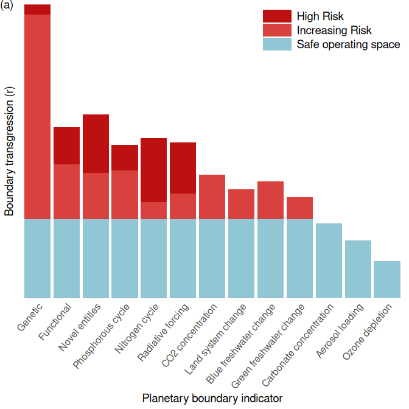
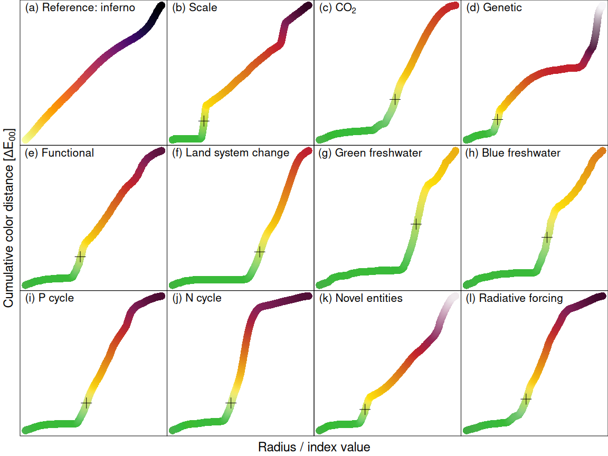

# Load code


```r
## Colorspace is used for general conversion between color spaces an the colorbar ~ HCL plot
library(colorspace)
## provides the colordiff function
library(ColorNameR)
## png is used for reading .png files, i.e. Figure 1 from Richardson et al. (2023)
library(png)
## Contains the "inferno" scale
library(viridisLite)
## For plotting
library(ggplot2)
library(patchwork)
library(ggthemes)

## custom functions
source("R/lib.R")
```

# Load data

load Figure 1 Richardson et al. (2023) and set some constants


```r
## constants for the transformation of the data transformation is log(x + logadder, base = logbase)
logadder <- 1
logbase <- exp(1)

## load data for reconstruction plot
ri_data <- scale_data(read.csv("data/richardson_data.csv"), base = logbase, adder = logadder)

## This sets the center of the circle, center coordinates taken from GIMP
ri_origin <- c(657, 687)

## This sets the radius of the safe operating space circle in pixels, samples taken from GIMP
ri_safe_radius <- mean(c(sqrt(sum((ri_origin - c(623, 530)) ^ 2)),
                         sqrt(sum((ri_origin - c(816, 666)) ^ 2)),
                         sqrt(sum((ri_origin - c(665, 847)) ^ 2))))

#### read in the original figure, this is an Array [height, width, channel] with
#### some attrs.
ri_fig <- png::readPNG("data/richardson_2023_fig1.png",
                       info = TRUE, native = FALSE)
```


# Color scale

Load the color scale in the bottom right corner of the Richardson et al. (2023)
fig. 1.


```r
#### read in the color scale of the plot
ri_scale <- ri_fig[1211, 880:1535, ]
ri_scale[, 1] <- smoother(ri_scale[, 1], 20)
ri_scale[, 2] <- smoother(ri_scale[, 2], 20)
ri_scale[, 3] <- smoother(ri_scale[, 3], 20)
ri_scale <- list(rgb = sRGB(ri_scale))
ri_scale$hex <- hex(ri_scale$rgb)
ri_scale$dist <- seq_along(ri_scale$hex)
```

# Visual Distortion

Here are some examples how the type of plot used by Richardson et al. (2023)
skews the perception of data


```r
# Lie factor
dummy_data <- data.frame(x = 1L:10L, y = 1:10)
dummy_data_2 <- prep_gradient(dummy_data$x, dummy_data$y)


# Black and white
g1 <- ggplot(ri_data) +
  aes(x = long_name, y = current_scaled, label = short_name) +
  geom_col() +
  scale_y_continuous("Radius in fig. (a)", expand = expansion(mult = c(0, 0))) +
  scale_x_discrete("Planetary boundary indicator", limits = rotr(ri_data$long_name, 2)) +
  geom_hline(yintercept = log(1 + logadder, base = logbase), linetype = "dashed", color = "white") +
  theme_tufte(base_family = "sans") +
  theme(axis.text.x = element_text(angle = 50, hjust = 1, size = 12),
        axis.title = element_text(size = 14),
        axis.ticks.x = element_blank(),
        axis.ticks.y = element_blank(),
        axis.text.y = element_blank())
g1
```

<!-- -->

```r
g2 <- ggplot(ri_data)+
  aes(x = fig_bar_position, y = current_scaled, label = short_name) +
  geom_col(width = ri_data$fig_bar_width * 40 - 2) +
  geom_hline(yintercept = log(1 + logadder, base = logbase), linetype = "dashed", color = "white") +
  ## labs(tag = "(b)") +
  coord_polar() +
  scale_x_continuous(expand = expansion(mult = c(0.0025, 0.0025))) +
  cowplot::theme_nothing() +
  theme(plot.margin = margin(0, 0, 0, 0),
        plot.tag = element_text(vjust = 8, hjust = -8))
g2
```

<!-- -->

```r
# with a color scale
g3 <- ggplot(dummy_data_2) +
  aes(x = x, y = y, fill = z) +
  ## scale_fill_viridis_c(option = "B", direction = -1) +
  scale_fill_gradientn(colours = ri_scale$hex) +
  geom_bar(stat = "identity") +
  cowplot::theme_nothing()
g4 <- g3 +
  scale_x_continuous(expand = expansion(mult = c(0.0025, 0.0025))) +
  coord_polar()

g3
```

<!-- -->

```r
g4
```

<!-- -->

```r
# with a discrete color scale
coltransform <- function(x) x
# To test for color blindness, uncomment one of the following lines
## coltransform <- function(x) colorspace::tritan(x)
## coltransform <- function(x) colorspace::deutan(x)
## coltransform <- function(x) colorspace::protan(x)
# discrete_colors is in order "High Risk", "Increasing Risk", "Safe operating space"
## discrete_colors <- c(ri_scale$hex[500], ri_scale$hex[200], ri_scale$hex[10])
discrete_colors <- c("#bd1111", "#d8413e", "#91c6d4")
g5 <- ggplot(ri_data) +
  aes(x = long_name, y = current_scaled) +
  geom_col(aes(fill = "High Risk"),
           data = ri_data[ri_data$current_scaled > ri_data$high_risk_boundary_scaled, ]) +
  geom_col(aes(fill = "Increasing Risk"),
           data = within(ri_data[ri_data$current_scaled > ri_data$safe_boundary_scaled, ], {
             j <- current_scaled > high_risk_boundary_scaled
             current_scaled[j] <- high_risk_boundary_scaled[j]
           })) +
  geom_col(aes(fill = "Safe operating space"),
           data = within(ri_data, {
             i <- current_scaled > safe_boundary_scaled
             current_scaled[i] <- safe_boundary_scaled[i]
           })) +
  scale_y_continuous("Boundary transgression (r)", expand = expansion(mult = c(0, 0))) +
  scale_x_discrete("Planetary boundary indicator",
                   ## limits = rotr(ri_data$long_name, 2)
                   limits = c(
                     "Genetic", "Functional",
                     "Novel entities",
                     "Phosphorous cycle", "Nitrogen cycle",
                     "Radiative forcing", "CO2 concentration",
                     "Land system change",
                     "Blue freshwater change", "Green freshwater change",
                     "Carbonate concentration",
                     "Aerosol loading",
                     "Ozone depletion"
                   )) +
  scale_fill_manual("Transgression", values = coltransform(discrete_colors)) +
  theme_tufte(base_family = "sans") +
  theme(axis.text.x = element_text(angle = 50, hjust = 1, size = 12),
        axis.title = element_text(size = 14),
        axis.ticks.x = element_blank(),
        axis.ticks.y = element_blank(),
        axis.text.y = element_blank(),
        legend.position = c(1, 1),
        legend.justification = c(1, 1),
        legend.text = element_text(size = 14),
        legend.title = element_blank(),
        legend.key.width = unit(1.3, "cm"))
```

```
## Warning: A numeric `legend.position` argument in `theme()` was deprecated in ggplot2 3.5.0.
## ℹ Please use the `legend.position.inside` argument of `theme()` instead.
## This warning is displayed once every 8 hours.
## Call `lifecycle::last_lifecycle_warnings()` to see where this warning was generated.
```

```r
g5
grid::grid.text("(a)", x = 0, y = 1, hjust = 0, vjust = 1, gp = grid::gpar(fontsize = 14))
```

<!-- -->

```r
fold_text <- function(x) gsub("\\s", "\n", x)

g6 <- g5 +
  aes(y = 0.5 * 2 * pi / 13 * sqrt(current_scaled)) +
  geom_text(aes(label = fold_text(long_name)), y = 0.36, size = 5) +
  geom_hline(yintercept = 0.5 * 2 * pi / 13 * sqrt(ri_data$safe_boundary_scaled[1]),
             color = "gray50") +
  coord_polar(direction = -1) +
  theme(axis.title = element_blank(),
        axis.text.x = element_blank(),
        legend.position = "none")
g6
grid::grid.text("(b)", x = 0, y = 1, hjust = 0, vjust = 1, gp = grid::gpar(fontsize = 14))
```

<!-- -->

# Measuring Visual Distortion
Lets plot the absolute visual error. Here we assume that $\text{pb} -
\text{holocene mean} == 1$, which after the transformation, as done by
Richardsone et al. results in $\text{holocene mean scaled} = 0$ and
$\text{planetary boundary scaled} = \log{2}$.

A full wedge has an angle of $\frac{360\deg}{9} - 4 = 36\deg$, ha half wedge has $18\deg$.


```r
gap <- 4 / 360 * 2 * pi # 4 degree in rads
n <- 9 # number of wedges
wedge_angle <- 2 * pi / n - gap
wedge_area <- 0.5 * ri_data$current_scaled ^ 2 * wedge_angle
ri_data$area_pb_plot <-
  ri_data$fig_bar_width * wedge_area

ggplot(ri_data) +
  aes(x = current_scaled, y = area_pb_plot,
      label = label_name, groups = factor(fig_bar_width)) +
  geom_smooth(method = "lm", se = FALSE,
              color = "black", formula = y ~ I(x^2),
              fullrange = TRUE) +
  geom_point(color = "black", size = 2) +
  geom_text(aes(x = current_scaled - ifelse(short_name == "p", -0.04, 0.02),
                y = area_pb_plot + ifelse(short_name == "p", -0.01, 0.02)),
            hjust = 1, vjust = 1,
            size = 4.5,
            parse = TRUE) +
  scale_x_continuous("Radius", limits = c(0, NA)) +
  scale_y_continuous("Area", limits = c(0, 1.05)) +
  geom_vline(xintercept = log(1 + logadder, base = logbase), linetype = "dashed") +
  annotate("text", x = log(1 + logadder, base = logbase), y = Inf, label = "Planetary Boundary",
           angle = 90, hjust = 1, vjust = -0.5, size = 4.5) +
  theme_classic() +
  theme(legend.position = "none",
        axis.title = element_text(size = 14))
```

```
## Warning: The following aesthetics were dropped during statistical transformation: label.
## ℹ This can happen when ggplot fails to infer the correct grouping structure in the data.
## ℹ Did you forget to specify a `group` aesthetic or to convert a numerical variable into a factor?
```

```
## Warning: Removed 24 rows containing missing values or values outside the scale
## range (`geom_smooth()`).
```

```
## Warning: Removed 1 row containing missing values or values outside the scale
## range (`geom_text()`).
```

<!-- -->

# Compose graphics

We need to compose the graphics into a single image.


```r
magick::image_write(
  magick::image_append(
    magick::image_scale(
    c(
      magick::image_trim(
        magick::image_read("Supplement_files/figure-html/bar_charts-2.png")
      ),
      magick::image_trim(
        magick::image_read("Supplement_files/figure-html/bar_charts-1.png")
      ),
      magick::image_trim(
        magick::image_read("Supplement_files/figure-html/area-1.png")
      )
    )
    )
  ),
  path = "fig/gray_bar_charts.png"
)
```


```r
im <- list(
  as.raster(ri_fig),
  as.raster(magick::image_trim(magick::image_read("Supplement_files/figure-html/bar_charts-2.png"))),
  as.raster(magick::image_trim(magick::image_read("Supplement_files/figure-html/bar_charts-1.png"))),
  as.raster(magick::image_trim(magick::image_read("Supplement_files/figure-html/area-1.png")))
)

asps <- im |> lapply(dim) |> sapply(function(x) x[2] / x[1])

hnew <- im |> lapply(dim) |> sapply(\(x) x[1]) |> max()
wnew <- sum(asps) * hnew

png("fig/lie_factor.png", width = wnew, height = hnew)

plot.new()
par(mar = c(0, 0, 0, 0), xpd = NA, mgp = c(0, 0, 0), oma = c(0, 0, 0, 0), ann = FALSE, xaxs = "i", yaxs = "i")
plot.window(0:1, 0:1)
sasps <- c(0, cumsum(asps))
saspsn <- sasps / tail(sasps, 1)
for (i in seq_along(im)) {
  rasterImage(im[[i]], saspsn[[i]], 0, saspsn[[i + 1]], 1)
  text(saspsn[[i]], 1, paste0("(", letters[[i]],  ")"), adj = c(0, 1), cex = 4)
}
```


```r
im <- list(
  as.raster(ri_fig),
  as.raster(magick::image_trim(magick::image_read("Supplement_files/figure-html/bar_charts-2.png"))),
  as.raster(magick::image_trim(magick::image_read("Supplement_files/figure-html/bar_charts-1.png"))),
  as.raster(magick::image_trim(magick::image_read("Supplement_files/figure-html/area-1.png")))
)

dims <- im |> lapply(dim)

h1 <- max(dims[[3]][1], dims[[4]][1])
h2 <- max(dims[[1]][1], dims[[1]][1])
h <- h1 + h2

w1 <- max(dims[[1]][2], dims[[3]][2])
w2 <- max(dims[[2]][2], dims[[4]][2])
w <- w1 + w2

a <- w / h

png("fig/lie_factor2.png", width = w, height = h)

plot.new()
par(mar = c(0, 0, 0, 0), xpd = NA, mgp = c(0, 0, 0),
    oma = c(0, 0, 0, 0), ann = FALSE,
    xaxs = "i", yaxs = "i")
plot.window(0:1, 0:1)
grid::grid.raster(im[[1]], 0.25, 0.75, width = 0.5)
grid::grid.raster(im[[2]], 0.75, 0.79, height = 0.34)
grid::grid.raster(im[[3]], 0.25, 0.25, height = 0.5)
grid::grid.raster(im[[4]], 0.75, 0.25, height = 0.5)
text(0,     1, paste0("(a)"), adj = c(0, 1), cex = 4)
text(0.5,   1, paste0("(b)"), adj = c(0, 1), cex = 4)
text(  0, 0.5, paste0("(c)"), adj = c(0, 1), cex = 4)
text(0.5, 0.5, paste0("(d)"), adj = c(0, 1), cex = 4)
dev.off()
```

```
## png 
##   2
```


# Color Scales in the Radial Bar Plot

The radial bar plot uses non-uniform color scales, here we extract them to get
exact measurements.

## Cutting Through the Wegdes

Change `angle` for different slices. `angle == 0` starts at the bottom and
rotates counterclockwise. Try to avoid text and other noise in the picture.

This is how you test and optimize the angles and cutoffs:


```r
i <- which(ri_data$short_name == "radiation")
ri_testbar <- bar_from_fig(ri_fig,
                           angle = ri_data$angle[i],
                           origin = ri_origin,
                           cutoff = ri_data$cutoff[i],
                           smooth = 30,
                           plot_diagnostic = TRUE)
```

<!-- -->


Here we read in all bars:

```r
ri_bars <- list()
for (i in seq_len(nrow(ri_data))) {
  ri_bars[[ ri_data$short_name[i] ]] <- bar_from_fig(
    ri_fig,
    angle = ri_data$angle[[i]],
    origin = ri_origin,
    cutoff = ri_data$cutoff[[i]],
    smooth = 30,
    plot_diagnostic = FALSE
  )
}

## str(ri_bars)
```

# Visual distance

Here we plot visual distance (cumulative distance in color space along the
gradient in CIELAB2000 color space) vs. the distance from the center of the
radial bar plot in Richardson et al. (2023) fig. 1.


```r
m <- 0
par(
  mfrow = c(3, 4),
  mar = c(m,m,m,m),
  oma = c(3, 3, 0, 0),
  bty = "o",
  xaxt = "n",
  yaxt = "n",
  xpd = NA
)
n <- 700
plot_coldist(list(dist = 1:n,
                  hex = inferno(n, direction = -1),
                  rgb = hex2RGB(inferno(n, direction = -1))),
             main = "(a) Reference: inferno")

## plot_coldist(list(dist = 1:n,
##                   hex = rainbow(n),
##                   rgb = hex2RGB(rainbow(n))),
##              main = "Reference: rainbow")

plot_coldist(ri_scale,
             main = "(b) Scale",
             safe_px_dist = 152)

interesting_scales <- c(
  "co2", "genetic", "functional",
  "luc", "green", "blue",
  "p", "n", "novel", "radiation"
)

for (i in seq_along(interesting_scales)) {
  s <- interesting_scales[[i]]
  plot_coldist(
    ri_bars[[s]],
    ## main = paste0("(",letters[i + 2] , ") ",
    ##              ri_data$long_name[[which(ri_data$short_name == s)]])
    ## main = expression(paste("(", letters[i + 2], ") "),
    ##                   ri_data$long_name[[which(ri_data$short_name == s)]])
    main = bquote(
      "(" * .(letters[[i + 2]]) * ") " *
        .(parse(text = ri_data$long_label_name[[which(ri_data$short_name == s)]])[[1]])
    ),
    safe_px_dist = ri_safe_radius
  )
}

mtext("Radius / index value", side = 1, line = 1.5,
      outer = TRUE, cex = 1.5, padj = 0)
mtext(expression(paste("Cumulative color distance [", Delta, E[0][0], "]")), side = 2,
      line = 0.5, outer = TRUE, cex = 1.5, padj = 0)
```

<!-- -->

# CVD simulations

The code for the CVD simulations can be found in the folder [./cvd_simulations/](./cvd_simulations/).


<div class="figure">

<p class="caption">The original PB figure (Richardson et al., 2023)</p>
</div>
<div class="figure">

<p class="caption">Deuteranopia simulation</p>
</div>
<div class="figure">

<p class="caption">Protanopia simulation</p>
</div>
<div class="figure">

<p class="caption">Tritanopia simulation</p>
</div>
<div class="figure">

<p class="caption">Full colour blindness (gray scale)</p>
</div>


```r
sessionInfo()
```

```
## R version 4.4.0 (2024-04-24)
## Platform: x86_64-pc-linux-gnu
## Running under: Manjaro Linux
## 
## Matrix products: default
## BLAS/LAPACK: /usr/lib/libopenblas.so.0.3;  LAPACK version 3.12.0
## 
## locale:
##  [1] LC_CTYPE=en_US.utf8        LC_NUMERIC=C              
##  [3] LC_TIME=en_US.utf8         LC_COLLATE=en_US.utf8     
##  [5] LC_MONETARY=de_DE.UTF-8    LC_MESSAGES=en_US.utf8    
##  [7] LC_PAPER=de_DE.UTF-8       LC_NAME=C                 
##  [9] LC_ADDRESS=C               LC_TELEPHONE=C            
## [11] LC_MEASUREMENT=de_DE.UTF-8 LC_IDENTIFICATION=C       
## 
## time zone: Europe/Berlin
## tzcode source: system (glibc)
## 
## attached base packages:
## [1] stats     graphics  grDevices utils     datasets  methods   base     
## 
## other attached packages:
## [1] ggthemes_5.1.0    patchwork_1.2.0   ggplot2_3.5.1     viridisLite_0.4.2
## [5] png_0.1-8         ColorNameR_0.1.0  colorspace_2.1-0 
## 
## loaded via a namespace (and not attached):
##  [1] Matrix_1.7-0      gtable_0.3.5      jsonlite_1.8.8    crayon_1.5.2     
##  [5] highr_0.10        dplyr_1.1.4       compiler_4.4.0    Rcpp_1.0.12      
##  [9] tidyselect_1.2.1  stringr_1.5.1     magick_2.8.3      jquerylib_0.1.4  
## [13] splines_4.4.0     scales_1.3.0      yaml_2.3.8        fastmap_1.1.1    
## [17] lattice_0.22-6    R6_2.5.1          labeling_0.4.3    generics_0.1.3   
## [21] knitr_1.46        tibble_3.2.1      munsell_0.5.1     bslib_0.7.0      
## [25] pillar_1.9.0      rlang_1.1.3       utf8_1.2.4        cachem_1.0.8     
## [29] stringi_1.8.3     xfun_0.43         sass_0.4.9        cli_3.6.2        
## [33] mgcv_1.9-1        withr_3.0.0       magrittr_2.0.3    digest_0.6.35    
## [37] grid_4.4.0        cowplot_1.1.3     nlme_3.1-164      lifecycle_1.0.4  
## [41] vctrs_0.6.5       evaluate_0.23     glue_1.7.0        farver_2.1.1     
## [45] fansi_1.0.6       rmarkdown_2.26    purrr_1.0.2       tools_4.4.0      
## [49] pkgconfig_2.0.3   htmltools_0.5.8.1
```
